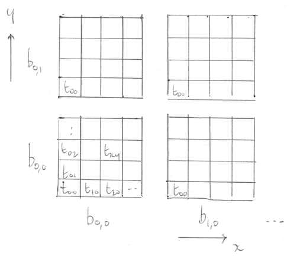

# The CUDA/HIP programming model

The application programmer does not want to have to worry about
the exact disposition of cores/SMs, or whatever, in the hardware.
An abstraction is wanted.

In CUDA and HIP, this abstraction is based on an heirarchical
organisation of threads.


## Decomposition into threads

If we have a one-dimensional problem, e.g., an array, we can assign
individual elements to threads.


Threads are typically executed in groups of 32, known as a *warp*
(the terminology is borrowed from weaving).


### Blocks

Groups of threads are further organised into blocks. In our
one-dimensional picture we may have:


Blocks are scheduled to SMs.

All blocks have the same number of threads per block. Typically
the maximum number of threads per block is 1024. A value of
128, 256, and so on is often selected (a whole number of warps).


### Two dimensions

For two-dimensional problems (e.g., images) it is natural to have
a two-dimensional Cartesian picture:



The arrangement of blocks is referred to as the *grid* in CUDA.

CUDA and HIP allow the picture to be extended straightforwardly
to three dimensions.


## Programming

NVIDIA developed CUDA in 2005 to make the job of programming
graphics applications easier. It allows the programmer to
write familiar C/C++ code which will run on a GPU.

The code divided into "host code" which runs on the host, and
"device code"  which runs on the GPU. In particular, computational
kernels should be targeted at the device.

Host code is standard C/C++ with a number of extensions.

Kernels require a specific "kernel language", which is just a subset
of C/C++. In particular, support for library functions is limited:
e.g., only `assert()` and `printf()` may be available.

Kernels may also be written in PTX (parallel thread execution), which
is the NVIDIA instruction set. Both C/C++ kernels or PTX kernels
must be compiled to a binary code for execution.


## Compilation

The NVIDIA compiler driver is `nvcc` (not to be confused with `nvc`
or `nvc++`). This is provided as part of the NVIDIA HPC Toolkit.

CUDA code is often placed in files with the `.cu` extension
```
$ nvcc code.cu
```
Use `nvcc --help` for a list of options. E.g., one may prefer to use more
standard file extensions as for C:
```
$ nvcc -x cu code.c
```
where the `-x cu` option instructs `nvcc` to interpret code as CUDA C.

### Compute capabilities

Different generations of hardware have different capabilities in terms
of the features they support. This is referred to as compute capability
or streaming multiprocessor architecture in the NVIDIA jargon.

The most recent NVIDIA hardware supports the following

| Hardware series | Compute capability or "SM" |
|-----------------|----------------------------|
| Hopper          | 9                          |
| Ampere          | 8                          |
| Volta           | 7                          |
| Pascal          | 6                          |

The consequence is that a program must be compiled for the relevant
architecture to be able to run. E.g.,
```
$ nvcc -arch=sm_70 code.cu
```
will run  on Volta. Minor versions such as `sm_72` also exist.

This should not be confued with the CUDA version. The SM is a hardware
feature, which the CUDA version is a software issue.


## Portability: CUDA and HIP

CUDA has been under development by NVIDIA since around 2005. AMD, rather
later to the party, develops HIP, which shadows CUDA. For
example, a C/C++ call to 
```
  cudaMalloc(...);
```
is simply replaced by
```
  hipMalloc(...);
```
with the same signature. HIP code can be compiled for NVIDIA GPUs by
inclusion of an appropriate wrapper which just substitutes the relevant
CUDA API routine.

Not all the latest CUDA functionality is implemented in HIP at any given
time.


## Summary

The goal for the programmer is to describe the problem in the
abstraction of grids, blocks, threads. The hardware is then
free to schedule work as it sees fit.

This is the basis of the scalable parallelism of the architecture.


The very latest CUDA programming guide is well worth a look. Note
there may be some features only supported on the very latest
hardware (CC) and CUDA version.

https://docs.nvidia.com/cuda/cuda-c-programming-guide/
